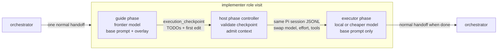
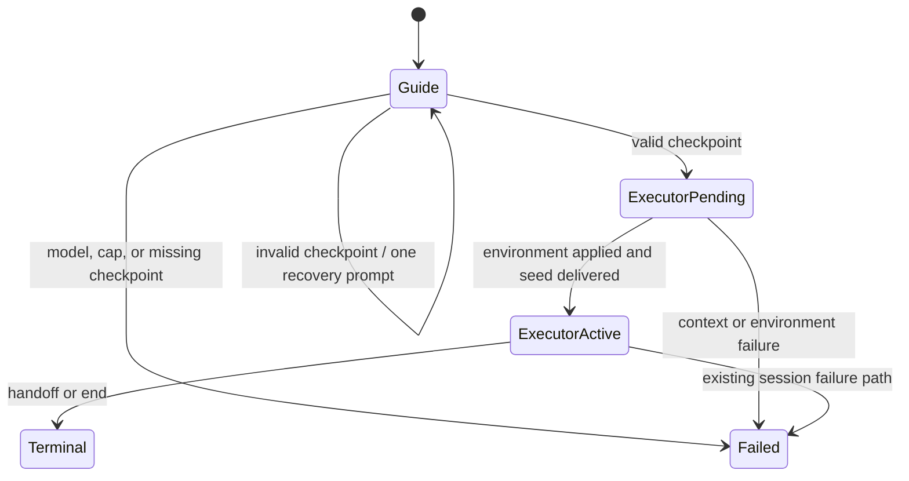

# pi-conductor: Intra-role Prewalk continuation

**Status:** Proposed MVP  
**Target:** `pi-conductor` after Issue #63 / v0.20.0  
**Primary decision:** Implement Prewalk as a model-phase change inside one worker role visit, not as a trajectory-preserving FSM handoff.

## Goal

Add an opt-in `prewalk` mode to a worker role.

When the orchestrator dispatches that role, a stronger guide model explores the repository, creates a bounded execution checklist with a validation step for every item, and lands one initial edit. The host then swaps to the role's normal executor model while preserving the exact Pi conversation and workspace state.

The guide-to-executor switch must:

- happen without invoking the orchestrator;
- remain inside one logical conductor role-session;
- preserve the native Pi session history rather than summarize it;
- remove the temporary guide instruction before the executor's first turn;
- leave the executor with an unfinished task, a concrete checklist, and one valid edit to continue;
- delay the normal `handoff` or `end` machine event until the executor is actually finished.

### Why change the Issue #63 approach

Issue #63 implements trajectory preservation across real role boundaries. That is useful for actual role handoffs, but it is not the same mechanism as Prewalk.

The current `handoff` tool is intentionally terminal. Its result tells the model that the loop will end the session, and the orchestration loop persists `session_ended` before continuing the physical conversation under another role. A planner → orchestrator → implementer trajectory therefore contains explicit role-completion signals and an intervening routing turn.

Prewalk instead asks the executor to continue what appears to be its own unfinished one-shot attempt. There should be no planner identity, terminal handoff, or orchestrator turn between exploration and execution.

The observed premature ending may still have another runtime cause; this is the leading behavioral hypothesis to lock down with a regression test.

Sources informing this decision:

- [Stencil: “You only need the frontier model for one single edit”](https://stencil.so/blog/prewalk)
- [`pi-conductor` Issue #63](https://github.com/lynellf/pi-conductor/issues/63)
- [`src/host/tools.ts`](https://github.com/lynellf/pi-conductor/blob/main/src/host/tools.ts)
- [`src/host/loop.ts`](https://github.com/lynellf/pi-conductor/blob/main/src/host/loop.ts)

## Assumptions

1. The MVP uses a shared workspace and one active parent role at a time.
2. The configured role's first `models[]` entry remains the executor model. `prewalk.guide` selects the temporary guide model.
3. Both models use the same base role system prompt. The guide receives one additional host-owned overlay that is removed at the switch.
4. A configured role uses Prewalk on every visit. A visit filter can be added later if repeated guide cost becomes a problem.
5. The guide explicitly calls `execution_checkpoint` immediately after its first successful edit. Automatic first-edit interception is not part of the MVP.
6. The role's existing `max_session_cost_usd` covers guide and executor usage together.
7. No context compaction, truncation, or fallback-to-fresh behavior occurs at the switch. An inadmissible executor context fails visibly.
8. The first implementation uses the current in-process shared SDK session. The native session file is still the durable transfer artifact and can support a later process boundary.
9. Roles with delegation are rejected for the MVP because a child could outlive the guide phase and complicate ownership.

## Requirements

### R1. One logical role visit

The orchestrator dispatches the configured worker once. Guide and executor are two phases of that one role visit.

The guide-to-executor switch must not produce:

- `transition_accepted`;
- `session_ended`;
- `session_started`;
- a new role visit;
- a new FSM target.

The normal conductor lifecycle resumes only when the executor emits `handoff` or `end`.

### R2. One physical conversation

Guide and executor use the same native Pi conversation ID and session JSONL.

The executor's first provider request must include the guide's prior user messages, assistant messages, tool calls, tool results, checklist checkpoint, and first edit trajectory.

Do not serialize that history into Markdown, a handoff payload, or a new user message.

### R3. One role identity

The guide is not the `senior-planner` role. It is the same implementer role running temporarily on a stronger model.

The guide receives:

```text
<normal implementer system prompt>

<temporary Prewalk guide overlay>
```

The executor receives:

```text
<normal implementer system prompt>
```

The executor must not receive the temporary overlay or a replacement “you are now the implementer” identity prompt.

### R4. Bounded execution checkpoint

Before the switch, the guide must:

1. explore enough to choose an implementation;
2. define 1–`max_todos` ordered TODOs;
3. include a concrete validation step for each TODO;
4. make at least one successful file mutation;
5. call `execution_checkpoint` while at least one TODO remains incomplete.

The checkpoint is a host control signal, not an FSM event.

### R5. Phase-specific tools

During the guide phase:

- enable the role's ordinary repository tools;
- enable `ask_user`;
- enable `execution_checkpoint`;
- disable `handoff`, `end`, and `delegate`.

During the executor phase:

- restore the role's normal tool allowlist;
- enable the existing `handoff`, `end`, and `ask_user` behavior;
- disable `execution_checkpoint`.

The guide cannot accidentally end the conductor role before the model switch.

### R6. Deterministic switch

The host may switch only while the native Pi session is idle.

Before the executor's first prompt, the host must:

1. resolve the executor model and effort;
2. calculate target context admission;
3. persist the exact session reference and target environment;
4. set the executor model and effort;
5. remove the guide overlay;
6. replace the active tool allowlist;
7. assert the applied model, effort, system prompt, and tools;
8. prompt the executor with the exact persisted continuation seed.

### R7. Durable boundary

The native Pi session JSONL is the context artifact.

A run-log record must point to that file and pin the executor environment before the switch is applied. A crash after that record can reopen the same conversation and complete the switch without rerunning the orchestrator or reconstructing context from prose.

### R8. Context admission

The required executor context is:

```text
current native session tokens
+ executor base system prompt envelope
+ executor tool definitions
+ continuation seed
+ executor maximum output reservation
```

If the estimate is unknown or exceeds the executor context window, fail with a typed Prewalk error. Do not compact, truncate, silently start fresh, or choose a different model.

### R9. Backward compatibility

A role without `prewalk` follows the current spawn and handoff path byte-for-byte.

Existing `handoffs[].mode: trajectory` remains available for genuine role-to-role trajectory preservation. This feature does not change its schema or semantics.

### Acceptance criteria

- A provider-backed test proves that the executor sees the guide's exact read/tool/edit history.
- The executor's inherited history contains no successful `handoff` or `end` call before its first turn.
- The executor's inherited history does not contain the text “the loop will end this session.”
- The executor receives the base role prompt with no Prewalk overlay.
- The executor receives the exact normal role tool allowlist and cannot call `execution_checkpoint`.
- No reducer transition or lifecycle terminal is recorded at the guide-to-executor switch.
- The executor can later emit a normal `handoff`, which the loop reduces exactly once.
- Invalid checkpoints remain in the guide turn and return an actionable correction.
- An executor context that is unknown or too large fails before executor generation.
- A crash between persisted switch selection and executor prompting can reopen the same native session and deliver the continuation seed exactly once.
- Existing roles and fresh handoffs remain unchanged.

## Design



The guide and executor are not FSM roles. They are execution phases inside the existing implementer role. This removes the orchestrator from the middle without adding illegal worker-to-worker FSM edges.

```mermaid
sequenceDiagram
    participant O as Orchestrator
    participant L as runLoop
    participant H as ProductionHost
    participant S as Native Pi session
    participant G as Guide model
    participant E as Executor model

    O->>L: handoff(implementer)
    L->>H: spawnRole(implementer)
    H->>S: create session with guide model
    H->>S: base implementer prompt + guide overlay
    L->>S: prompt(original implementer seed)
    S->>G: begin one-shot implementation
    G->>S: read / grep / test hypotheses
    G->>S: make first edit
    G->>S: execution_checkpoint(TODOs, validations)
    S-->>H: native turn stops; conductor prompt remains open
    H->>H: admit executor context
    H->>H: persist prewalk_switch_selected
    H->>S: set executor model and effort
    H->>S: remove guide overlay
    H->>S: activate normal implementer tools
    H->>S: prompt(continue from first incomplete TODO)
    S->>E: same conversation and workspace
    E->>S: finish implementation and verification
    E->>S: handoff(orchestrator)
    S-->>L: outer RoleSession.prompt resolves
    L->>L: reduce one machine event
```

`RoleSession.prompt()` becomes a small composite driver. The native guide turn may stop at `execution_checkpoint`, but the outer conductor prompt does not resolve until the executor emits the role's real terminal machine event.



Only `Terminal` is visible to the conductor FSM as the end of the role visit.

### Manifest contract

Example:

```yaml
version: 2

roles:
  - name: orchestrator
    is_orchestrator: true
    # existing configuration

  - name: implementer
    max_visits: 6
    models:
      - model: omlx:Qwen3.8-27B-oQ4e-mtp
        effort: high
    max_session_cost_usd: 8
    system_prompt: roles/implementer.md
    tools: [read, write, edit, bash]
    prewalk:
      guide:
        model: openai:gpt-5.6-terra
        effort: high
      max_todos: 12
```

Normalized type:

```ts
export interface PrewalkGuideConfig {
  readonly model: string;
  readonly effort: ModelEffort;
}

export interface PrewalkConfig {
  readonly guide: PrewalkGuideConfig;
  readonly max_todos: number; // default 12; valid range 1..20
}

export interface RoleConfig {
  // existing fields
  readonly prewalk?: PrewalkConfig;
}
```

Static validation rejects a `prewalk` block when:

- the role is the orchestrator;
- the guide model is missing or malformed;
- the role has no explicit executor model;
- the role has no explicit system prompt;
- `max_todos` is outside `1..20`;
- the workspace backend is not `shared`;
- the role enables conductor delegation.

No new top-level handoff policy is required.

### Prompt environments

| Property | Guide phase | Executor phase |
| --- | --- | --- |
| Logical role | implementer | implementer |
| Base system prompt | implementer prompt | same implementer prompt |
| Temporary overlay | present | removed |
| Model | `prewalk.guide` | `models[0]` |
| Active machine tools | none | `handoff`, `end` |
| Control tool | `execution_checkpoint` | none |
| Conversation/session file | unchanged | unchanged |
| Workspace | unchanged | unchanged |
| Cost state | shared | shared |

Suggested host-owned overlay:

```text
Work as the sole implementer for the assigned task.

Explore the repository deeply enough to choose a concrete implementation.
Create no more than {{max_todos}} ordered TODO items, each with a specific
validation step. Make one correct initial edit. Immediately after that edit,
call execution_checkpoint with the checklist and edited path.

Do not hand off, declare completion, or continue through the entire checklist
during this phase.
```

The overlay is supplied through the existing dynamic `before_agent_start` system-prompt hook. At the switch, `activeSystemPrompt` becomes the unchanged base prompt.

### `execution_checkpoint` tool

New file: `src/host/prewalk-tool.ts`.

```ts
export interface ExecutionCheckpointArgs {
  readonly todos: readonly {
    readonly task: string;
    readonly validation: string;
    readonly status: "done" | "in_progress" | "pending";
  }[];
  readonly first_edit_path: string;
}
```

Validation:

- item count is `1..max_todos`;
- `task` and `validation` are non-empty after trimming;
- at least one item is `in_progress` or `pending`;
- `first_edit_path` is a normalized path inside the role workspace;
- the host's mutation ledger contains a successful mutation for that path after the guide phase began;
- only one valid checkpoint may be captured.

An invalid call returns `terminate: false` with the exact correction.

A valid call:

1. stores the structured checkpoint in a dedicated `PrewalkSeam`;
2. returns neutral text:

   ```text
   Execution checkpoint recorded. Continue from the first incomplete TODO.
   ```

3. returns `terminate: true` to stop only the current native model turn.

It must not:

- write to `SessionSeam`;
- call the reducer;
- seal ordinary side-effect tools;
- emit `handoff` or `end`;
- say that the role or session has ended.

### Composite role-session driver

New file: `src/host/prewalk-role-session.ts`.

Conceptual behavior:

```ts
async function prompt(seed: string): Promise<void> {
  if (phase === "guide") {
    await nativeSession.prompt(seed);

    if (!prewalkSeam.hasValidCheckpoint()) {
      await nativeSession.prompt(MISSING_CHECKPOINT_RECOVERY);
    }

    const checkpoint = prewalkSeam.requireValidCheckpoint();
    await switchToExecutor(checkpoint);
  }

  await nativeSession.prompt(CONTINUATION_SEED);
}
```

Rules:

- allow one same-session recovery prompt when the guide stops without a checkpoint;
- after the second miss, mark `prewalk_checkpoint_missing`;
- do not return to `runLoop` between native guide and executor prompts;
- expose one logical `RoleSession` ID for the whole visit;
- expose the currently active logical model through a getter so `session_started` identifies the guide and `session_ended` identifies the executor;
- accumulate guide and executor usage under the same session cap.

`runLoop`, `reduce`, and `reduceLifecycle` should require no Prewalk-specific branch.

### Durable context and switch record

Use the existing native session file as the exact context artifact:

```text
.pi-conductor/runs/<run-id>/sessions/<conversation-id>.jsonl
```

Do not create a second transcript or copy messages into a generated prompt.

Add `src/persistence/prewalk-records.ts`:

```ts
export interface PrewalkSwitchSelectedRecord {
  readonly type: "prewalk_switch_selected";
  readonly schema_version: 1;
  readonly run_id: string;
  readonly role: Role;
  readonly role_session_id: string;
  readonly conversation: {
    readonly id: string;
    readonly file: string;
  };
  readonly guide: {
    readonly model: string;
    readonly effort: ModelEffort;
  };
  readonly executor: {
    readonly model: string;
    readonly effort: ModelEffort;
    readonly system_prompt: string;
    readonly active_tool_names: readonly string[];
    readonly continuation_seed: string;
    readonly environment_sha256: string;
  };
  readonly checkpoint: ExecutionCheckpointArgs;
  readonly admission: TrajectoryAdmission;
  readonly guide_usage: UsageRecord;
  readonly ts: number;
}

export interface PrewalkExecutorSeedDeliveredRecord {
  readonly type: "prewalk_executor_seed_delivered";
  readonly schema_version: 1;
  readonly run_id: string;
  readonly role_session_id: string;
  readonly conversation_id: string;
  readonly continuation_seed_sha256: string;
  readonly ts: number;
}
```

Persist `prewalk_switch_selected` after context admission and before mutating the native session environment.

Persist `prewalk_executor_seed_delivered` immediately after the exact continuation seed has been submitted. Resume must never submit that seed twice.

The existing run log is the durable descriptor. The `conversation.file` value is the artifact passed to a future process-backed worker.

### Direct worker transfer

For the MVP, “worker-to-worker” is a logical ownership transfer:

```text
guide RoleSession adapter
        │
        │ native session becomes idle
        ▼
host phase controller
        │
        │ same AgentSession + session JSONL
        ▼
executor RoleSession adapter
```

The source listener detaches before executor traffic. The executor listener then attaches to the same native session and the same logical role-session accounting.

No orchestrator prompt runs between the adapters.

The transfer contract is already process-capable: a future executor process can receive `conversation.file`, reopen it with `SessionManager.open()`, apply the persisted executor environment, and continue. That process boundary is not required to prove the feature.

### Context admission and failure

Reuse the Issue #63 admission calculator after generalizing its name away from role handoffs.

Typed failures:

```text
prewalk_checkpoint_missing
prewalk_checkpoint_invalid
prewalk_context_unknown
prewalk_context_metadata_unknown
prewalk_context_too_large
prewalk_environment_unsupported
prewalk_environment_apply_failed
prewalk_resume_invalid
```

On failure:

- persist `prewalk_switch_failed`;
- mark the one logical role-session failed;
- preserve the session JSONL and workspace for diagnosis;
- do not start a fresh executor;
- do not route through the orchestrator as a fallback.

### Resume boundary

The MVP guarantees deterministic recovery at the guide/executor boundary:

1. `prewalk_switch_selected` exists;
2. `prewalk_executor_seed_delivered` does not exist;
3. reopen the exact `conversation.file`;
4. verify conversation identity;
5. apply the persisted executor environment;
6. submit the exact persisted continuation seed;
7. persist delivery.

A crash during an active guide or executor provider turn continues to use the existing run/session reconciliation behavior. Extending exact replay into partially completed provider turns is out of scope.

### Observability

Add three records:

```text
prewalk_switch_selected
prewalk_executor_seed_delivered
prewalk_switch_failed
```

`prewalk_switch_selected` supplies enough information to answer:

- which guide and executor models were used;
- how much guide usage accrued before the switch;
- how many TODOs were created;
- which file received the first edit;
- how much executor context was admitted;
- which native conversation spans both phases.

Do not create separate conductor role-session lifecycle records for the phases.

### Code changes

| File | Minimal change |
| --- | --- |
| `src/manifest/types.ts` | Add `PrewalkConfig` and `RoleConfig.prewalk`. |
| `src/manifest/parse.ts` | Parse `prewalk.guide` and default `max_todos` to 12. |
| `src/manifest/validate.ts` | Add the static validations above. |
| `src/host/prewalk-tool.ts` | Implement `execution_checkpoint` and `PrewalkSeam`. |
| `src/host/prewalk-role-session.ts` | Drive guide prompt, switch, and executor prompt as one outer prompt. |
| `src/host/shared-sdk-role-spawn.ts` | Register the checkpoint tool; make prompt/model/tool environment phase-aware. |
| `src/host/production-host.ts` | Resolve guide/executor environments, perform admission, and persist switch records. |
| `src/host/role-session.ts` | Permit a custom prompt driver and dynamic active-model getter. |
| `src/persistence/prewalk-records.ts` | Define, validate, and materialize the three durable record types. |
| `src/persistence/log.ts` | Add the new record types to the persisted union. |

Do not change:

```text
src/core/reduce.ts
src/core/reduce-lifecycle.ts
src/seam/schema.ts
handoff() arguments
handoffs[].mode
```

`src/host/loop.ts` should remain unchanged unless a test proves the composite `RoleSession.prompt()` seam cannot satisfy the existing contract.

## Build plan

### 1. Lock down the failure

Add a provider-stub regression test around the current Issue #63 chain.

Prove that a trajectory target currently inherits the terminal `handoff` tool result and, for the planner → orchestrator → implementer chain, an intervening orchestrator turn. Record whether the observed real failure is:

```text
immediate handoff
immediate end
no_emission
provider stop
host/session error
```

This confirms whether the behavioral hypothesis matches the live failure without blocking the new design.

### 2. Add manifest and persistence contracts

Implement parsing, normalization, validation, and record materialization.

Checks:

```bash
pnpm typecheck
pnpm test -- manifest prewalk-records
```

### 3. Add the checkpoint tool

Implement `PrewalkSeam`, checkpoint validation, mutation-path validation, and the neutral terminating result.

Provider-stub tests must prove:

- `handoff` and `end` are absent during guide;
- invalid checkpoint calls remain nonterminal;
- valid checkpoint ends only the native guide turn;
- no machine-event capture exists after the checkpoint.

### 4. Add the composite prompt driver

Wrap one native guide prompt and one native executor prompt behind the existing `RoleSession.prompt()` call.

Assert:

- same conversation ID and session file;
- same logical conductor role-session ID;
- guide overlay present only in guide request;
- executor model/effort/tools applied exactly;
- no lifecycle or reducer record at the switch;
- normal executor handoff still reduces once.

### 5. Add admission and boundary resume

Generalize the current trajectory admission helper, persist the switch before mutation, and reopen the exact session for a pending executor seed.

Test the three crash points:

```text
before switch record
after switch record / before environment apply
after environment apply / before seed-delivered record
```

Only the last two use the durable Prewalk boundary contract.

### 6. Run the experiment

Compare:

```text
A. local executor one-shot
B. current planner → orchestrator → implementer trajectory
C. intra-role Prewalk guide → executor
```

Measure:

- task pass/completion rate;
- premature terminal rate;
- repeated repository reads after the switch;
- guide and executor input/output/cache tokens;
- switch prefill time and executor TTFT;
- wall time;
- total API-equivalent cost;
- context-admission failures.

The feature is successful only if C reduces repeated exploration and premature endings without materially reducing completion quality.

## Concerns & Expansions

### Automatic first-edit switching

A closer Stencil reproduction would capture the TODO list first, wrap mutating tools, and switch automatically after the first successful edit. This removes reliance on the guide calling `execution_checkpoint` promptly, but it requires synchronous mutation interception and forced turn termination. Add it only after the explicit checkpoint path is reliable.

### Separate Node-process workers

The durable `conversation.file` reference allows the executor to reopen the session in another process. That requires a stable public Pi SDK path for recreating the exact provider/runtime, tool registry, CWD, and extension environment. This should follow resolution of the runtime API compatibility tracked by `pi-conductor` Issue #67.

### Isolated workspaces

Supporting worktree, copy, or container roles requires proving that reopened built-in tools and custom tools bind to the same workspace authority. The shared-workspace MVP intentionally avoids that rebind problem.

### Delegation during the guide phase

A guide-spawned child can outlive the phase switch and return into a different model environment. Supporting this requires explicit child ownership across phases. Do not enable `delegate` in the MVP.

### Direct worker-to-worker FSM edges

Do not add them for Prewalk. A direct planner-role → implementer-role edge still creates a semantic role boundary and exposes planner identity. It also expands reducer policy for no benefit to the one-shot continuation behavior.

### Context compaction or fallback

Compaction, truncation, and fallback-to-fresh make the experiment harder to interpret because the executor no longer receives the exact guide trajectory. Treat each as a separate opt-in experiment after the core path is measured.

### Transcript UI

RunLedger can later display one role transcript with guide/executor model-phase markers from `prewalk_switch_selected`. This is an analytics enhancement, not a runtime requirement.
